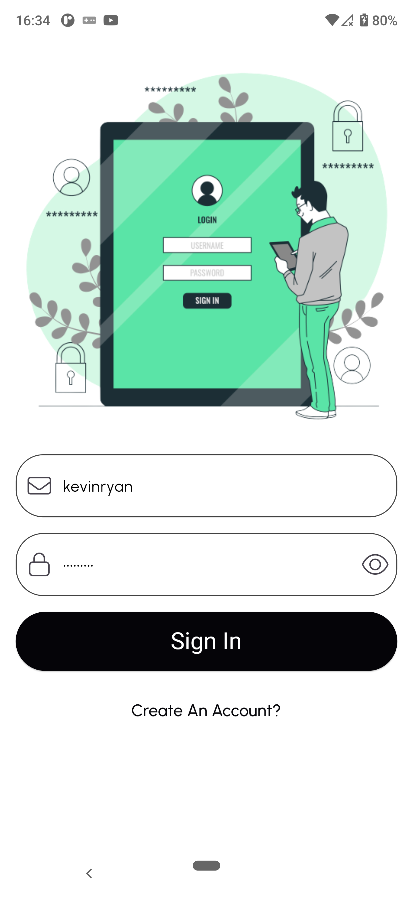

Please complete the assignment below and share as soon as you can.

Requirements:

Create a mobile application that lists products with Product Name, Price, Description, Category, and Image.
By default, it should display the first 10 products. When the user scrolls down, it should load more products.
When the user clicks on any product, it should redirect the user to the details page where all this data is displayed.
Implement a login page in the app. If the user is not logged in, they should be directed to the login page; otherwise, the user should be redirected to the product listing page.
If a user is already logged in and opens the application again, they should be redirected to the product listing page.
Utilize the following API, https://fakestoreapi.com/docs, to create this application.

